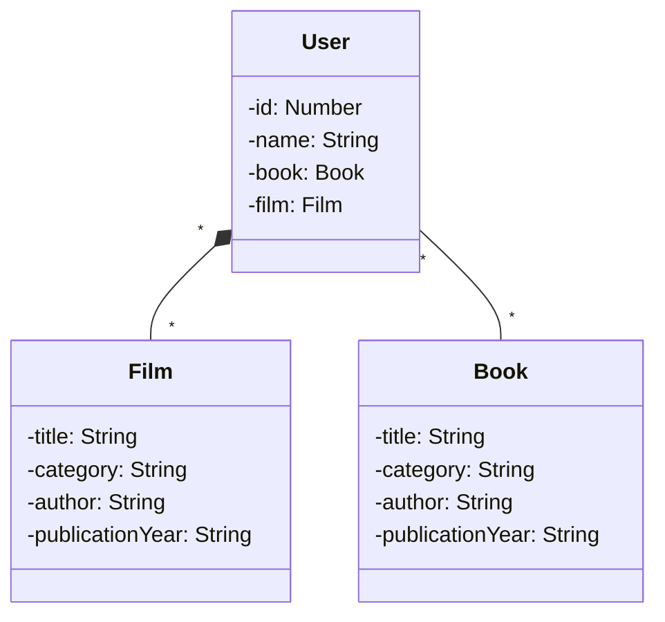

# Desafio-Cloud-RestAPI

```mermaid
classDiagram
  class User {
    -id: Number
    -name: String
    -book: Book
    -film: Film
  } 
  class Book{
    -title: String
    -category: String
    -author: String
    -publicationYear: String
  }
   class Film{
    -title: String
    -category: String
    -author: String
    -publicationYear: String
  }


  User "*" *-- "*" Film
  User "*" -- "*" Book
```
