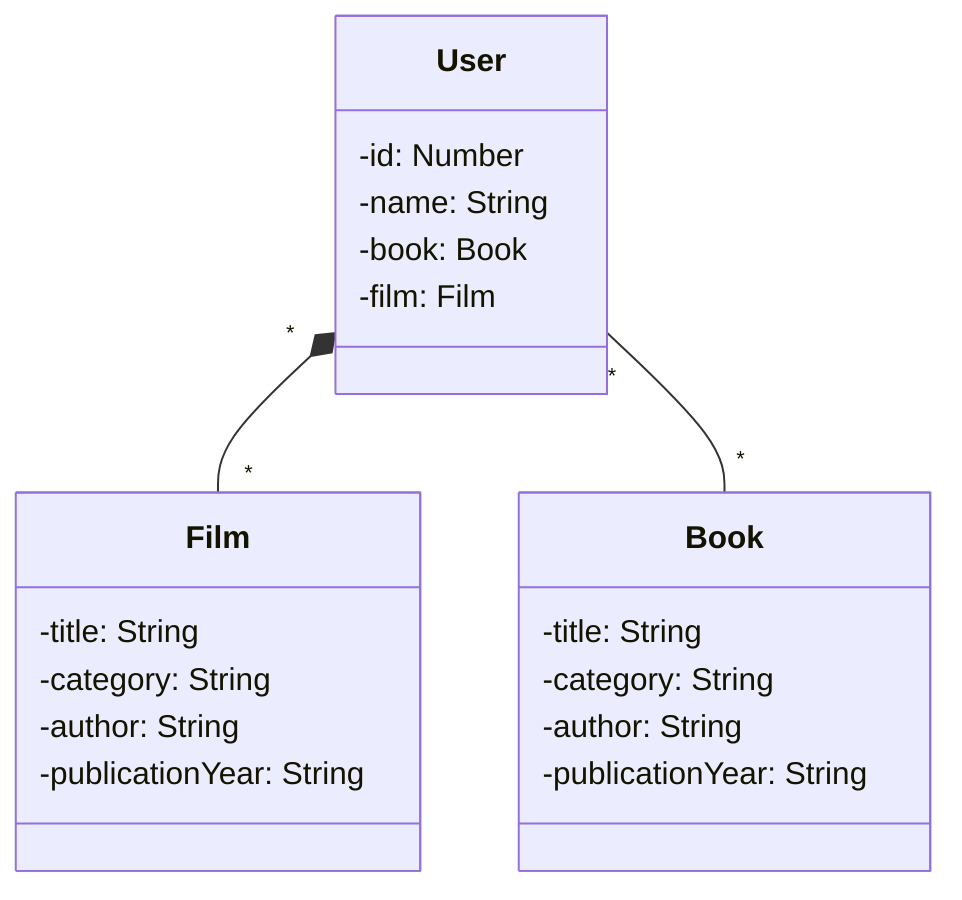

# Desafio-Cloud-RestAPI

Repositório para armazenar API RESTful para o desafio Publicando Sua API REST na Nuvem Usando Spring Boot 3, Java 17 e Railway
Foram utilizadas as seguintes tecnologias:
Spring web, Spring data JPA, Postgres database, Lombok e OpenApi(Swagger)

