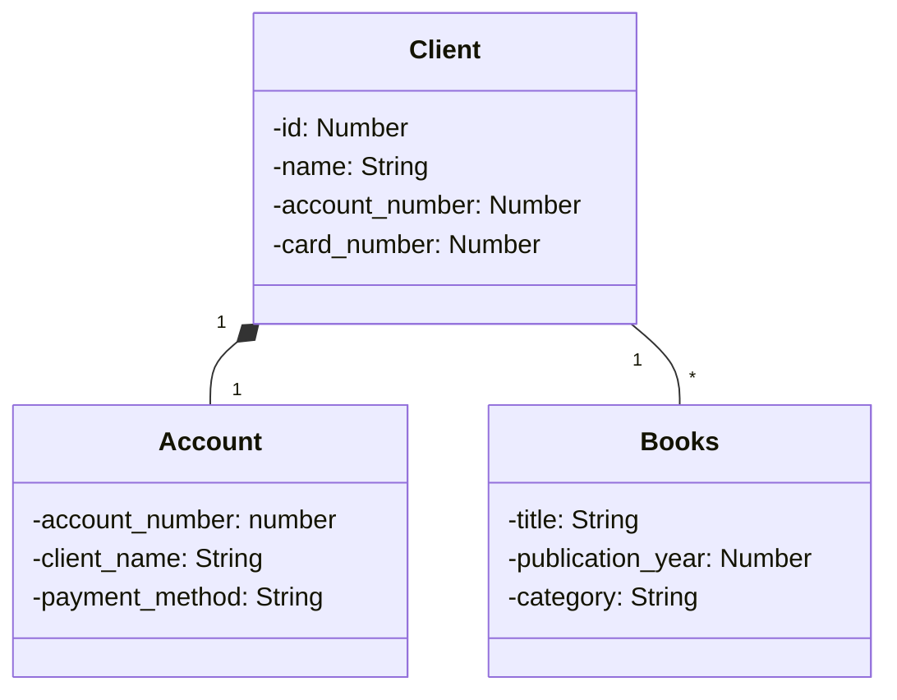

# Desafio-Cloud-RestAPI

```mermaid
classDiagram
  class Client {
    -id: Number
    -name: String
    -account_number: Number
    -card_number: Number
  } 

  class Account {
    -account_number: number
    -client_name: String
    -payment_method: String
  }

  class Books{
    -title: String
    -publication_year: Number
    -category: String
  }

  Client "1" *-- "1" Account
  Client "1" -- "*" Books
```
